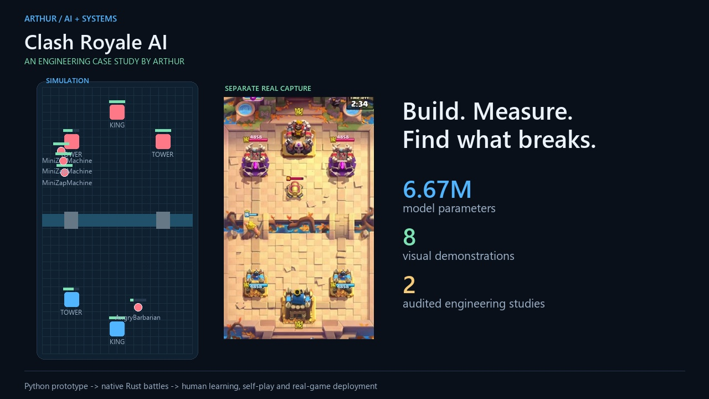

# Clash Royale AI — an engineering case study

**A visual portfolio by Arthur: building, training, evaluating and deploying a game-playing AI.**

[Watch the gallery →](https://24mil.github.io/Arthur/) · [90-second overview](https://24mil.github.io/Arthur/#overview) · [Architecture](https://24mil.github.io/Arthur/#architecture) · [Experimental evidence](EVIDENCE.md)

I own the project's direction, experiments, integration and validation across the stack. It began with an inspectable Python battle simulator and developed into a native Rust engine, a PyTorch player, human-replay learning, self-play evaluation and a real-game deployment harness.

The frozen model highlighted here has **6,672,466 parameters**, including **5,152,965 in its policy path**. It combines spatial processing with entity/event transformers and chooses actions in stages: play or wait, card, placement, ability carrier and wait duration. The training critic is separate from deployed actor inputs.

The gallery shows eight short demonstrations:

| Build | Learn and decide | Validate and deploy |
|---|---|---|
| [Python prototype](https://24mil.github.io/Arthur/#python-prototype) | [Neural probabilities](https://24mil.github.io/Arthur/#neural-decisions) | [Memory observations](https://24mil.github.io/Arthur/#memory-observations) |
| [Rust battle engine](https://24mil.github.io/Arthur/#rust-engine) | [Engine search](https://24mil.github.io/Arthur/#engine-search) | [Deployment architecture](https://24mil.github.io/Arthur/#deployment) |
| | [Human learning](https://24mil.github.io/Arthur/#human-learning) | [Self-play workflow](https://24mil.github.io/Arthur/#self-play) |

Two findings capture the engineering approach. Fixing an imitation model's evaluation interface changed its simulator score against L10 from **7.4% to 67.2%**, without retraining. Public-belief engine search scored **+99 relative simulator Elo [74, 125]** against the same network without search, across 512 games. [Methods and limits](EVIDENCE.md).

The research objective is superhuman play; that has **not** been established. Simulator results, historical phone footage and offline integration evidence are labeled separately. A fresh on-phone policy recording remains pending device availability.

**Implementation stays private.** This repository contains only presentation material and the static gallery. Code can be discussed privately with internship teams. Development includes AI-assisted coding and analysis; experiments and integration are validated against recorded evidence.

[GitHub profile / contact](https://github.com/24mil)

This material is unofficial and is not endorsed by Supercell. Gameplay belongs to Supercell; see the [Fan Content Policy](https://supercell.com/en/fan-content-policy/).
