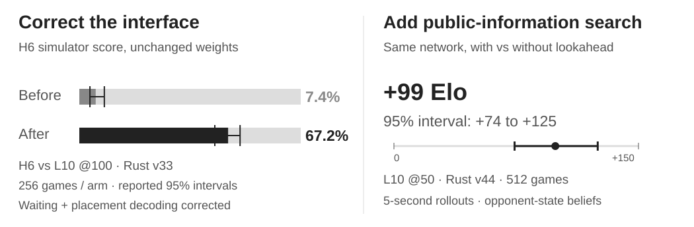
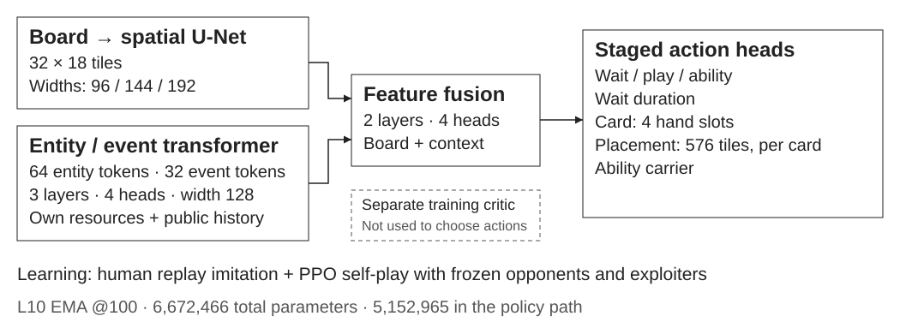

<h1 align="center">Clash Royale AI</h1>

  
  
  

An AI player built around a **Rust battle simulator**, a neural policy and learning from human replays and self-play. My work covers system design, experiments, integration and validation across the stack.

## Watch it choose a move

**One 24-second demo:** three card plays and one wait. See the card percentages, selected placement and the resulting battle in the project's existing replay viewer.

https://github.com/user-attachments/assets/a47982f9-31f2-49e1-93ad-d5e7afd7db02

Frozen **L10 EMA @100 · Rust v45**. These are recorded simulator decisions; percentages describe action choices, not win chances. A real-game recording with matching annotations will follow separately.

## Engineering that improved results

- **Fix the interface:** matching waiting and placement decoding to training changed H6's simulator score from **7.4% to 67.2%**, without retraining.
- **Look ahead:** public-information search added **+99 simulator Elo** against the same network without search; reported 95% interval **+74 to +125**, over **512 games**.

[Models, opponents, methods and limitations](EVIDENCE.md). Superhuman play remains the research goal.

## How it works

The Python prototype led to the native Rust engine. Human replay commands provide imitation examples; PPO, frozen opponents and exploiters support further learning. Real-game integration uses memory-derived observations.

**Implementation, weights and datasets remain private**, available for discussion with internship teams. Development includes AI-assisted coding and analysis. [Contact Arthur](https://github.com/24mil).

Unofficial project, not endorsed by Supercell. [Fan Content Policy](https://supercell.com/en/fan-content-policy/).
