

  

<h1 align="center">Clash Royale AI</h1>

  
  
   
  
  
  

  <a href="overview.mp4">90-second overview</a> ·
  <a href="#the-model">Model architecture</a> ·
  <a href="#learning-from-human-games">Human learning</a> ·
  <a href="#what-the-experiments-show">Results</a> ·
  <a href="EVIDENCE.md">Methods and evidence</a>

An end-to-end game-playing AI project by **Arthur**: battle simulation, a neural player, human-replay learning, self-play and real-game integration. I own the direction, experiments, integration and validation across the stack. **Application code, weights and datasets stay private.**

## Rust battle simulator

The current engine runs movement, targeting, combat, card cycles and deployment mechanics in Rust. This is the **existing project replay viewer**, displaying frozen native frames with its own playback controls, unit inspection and HP display.

[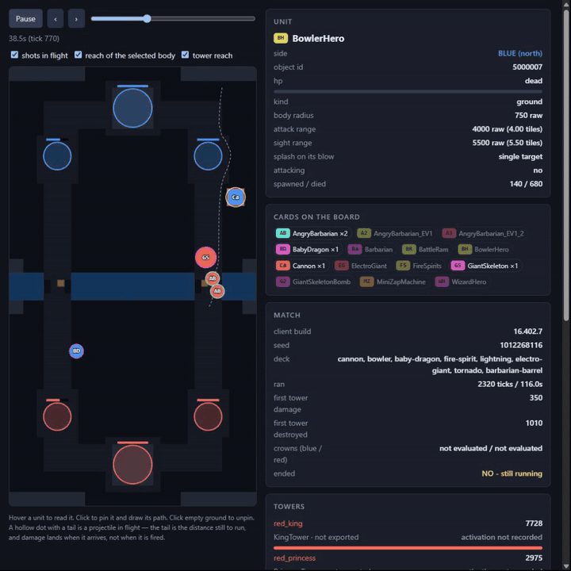](rust-engine.mp4)

[Full viewer recording](rust-engine.mp4) · L10 EMA @100, native_v45 · sped-up recorded states. Unexported fields are labeled; this is a bounded illustration, not a fidelity or strength test.

<strong>Python prototype — historical</strong>

The original implementation established the inspectable simulation workflow. Rust is now the behavioral authority. This bounded, scripted scenario is shown through the same project viewer.

[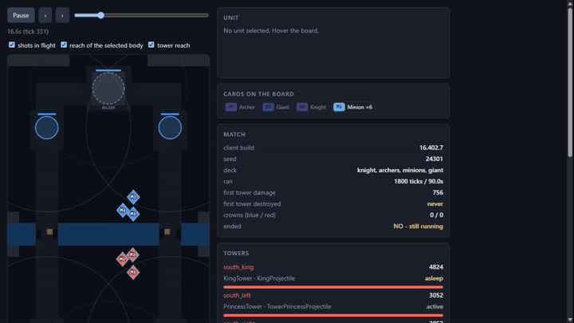](python-prototype.mp4)

[Full recording](python-prototype.mp4)

## The model

Spatial board features and entity/event tokens pass through spatial processing, transformers and feature fusion. Separate heads choose the action type, card, placement, ability carrier and waiting duration.

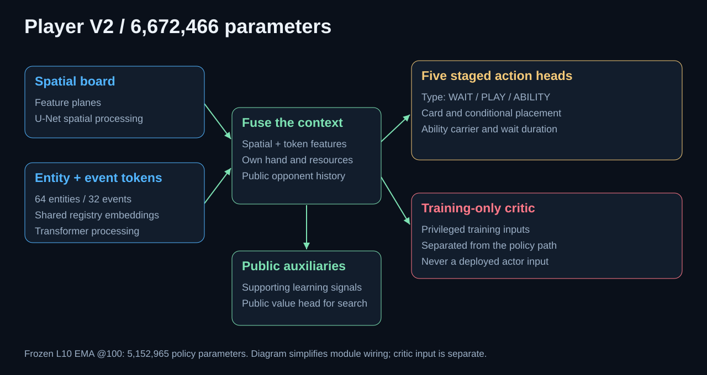

The loaded **L10 EMA @100** checkpoint contains **6,672,466 parameters**, including **5,152,965 in the policy path**. The critic is a training component.

<strong>Recorded probabilities and placement heatmaps</strong>

These are offline diagnostic figures from actual frozen policy outputs, not a recreated application interface or a verbal explanation of the model's reasoning.

[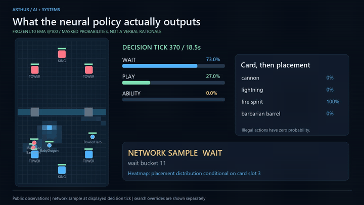](neural-decisions.mp4)

[Full diagnostic sequence](neural-decisions.mp4) · [Inspect one decision](decision-detail.jpg)

## Learning from human games

Recorded card choices, placements and ability markers feed Rust reconstruction and imitation learning. Recorded commands and reconstructed board state remain distinct; unsupported labels are masked.

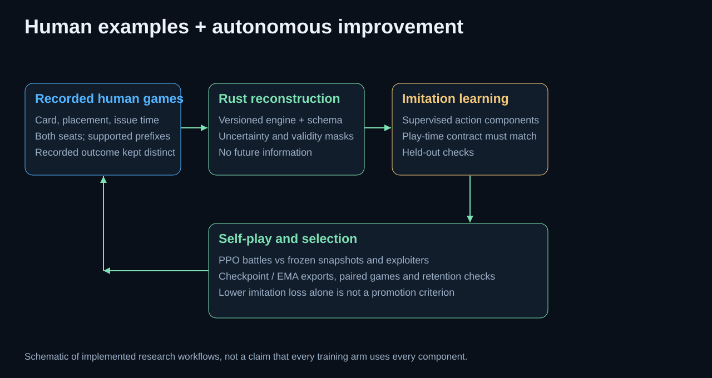

<strong>Recorded actions and self-play demonstrations</strong>

[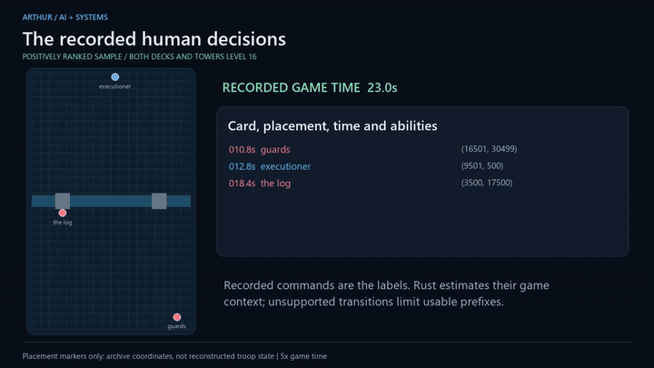](human-learning.mp4)

[Recorded-action demonstration](human-learning.mp4) · Placement markers are not recorded troop trajectories. Level 16 does not establish Ultimate Champion league.

[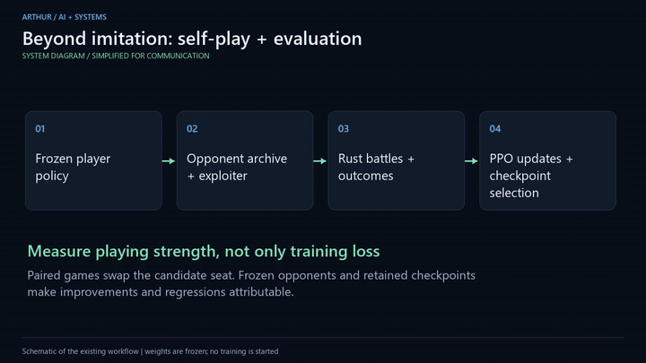](self-play.mp4)

[Self-play walkthrough](self-play.mp4) · Workflow illustration; no active training run is implied.

## Engine search

Candidate actions are compared through simulated futures. A public belief supplies unknown opponent state; the candidate scores and selected branch shown here are recorded outputs.

[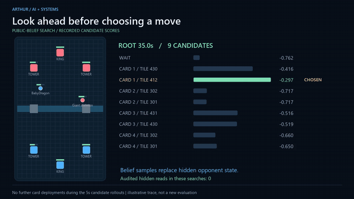](engine-search.mp4)

[Full search diagnostic](engine-search.mp4) · Five-second rollouts; no additional deployments; six recorded searches with zero audited hidden reads.

## Real-game observations and deployment

The deployed observation route uses **memory-derived state**. The capture below shows the existing game interface. It is an archived **human TV Royale replay**, not the showcased model playing.

<a href="deployment.mp4">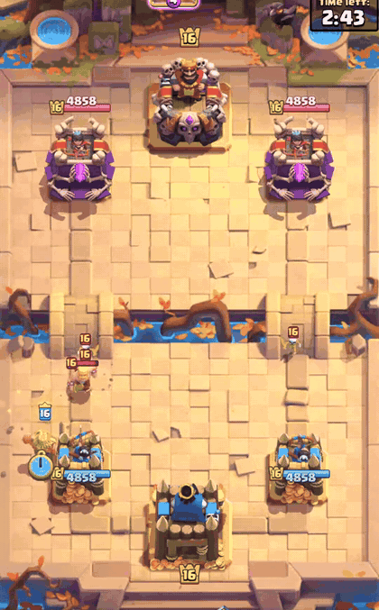</a>

[Full capture](deployment.mp4) · Recorded 8 September 2026 · Player/clan identification cropped out.

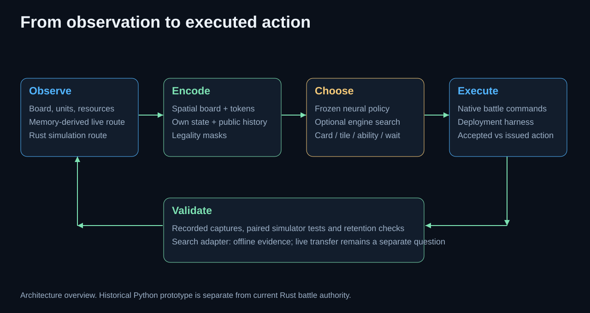

<strong>Inspect the archived observation outputs</strong>

The diagnostic uses 20 recorded memory snapshots. Verified identity/coordinates are displayed; unverified HP is omitted. Reads were non-atomic and are not claimed to align exactly with video frames.

[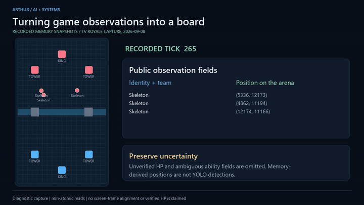](memory-observations.mp4)

[Observation diagnostic](memory-observations.mp4) · The search adapter also has offline evidence on 103 captures. A fresh model-on-phone recording remains pending a connected device.

## What the experiments show

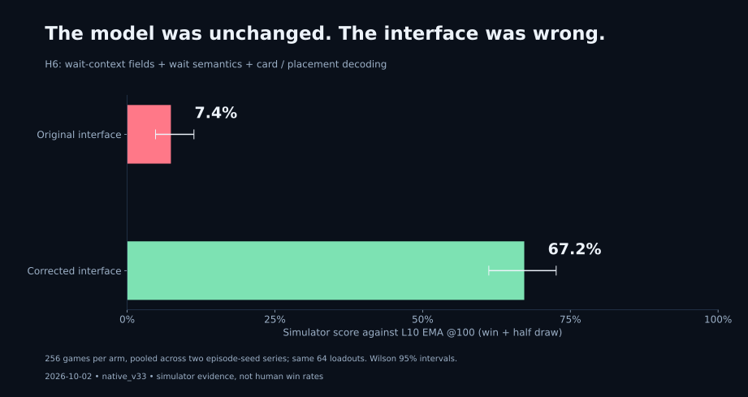

**H6 vs L10 EMA @100, native_v33:** 256 games per arm. Waiting and placement interface corrections changed the score from 7.4% to 67.2%, with unchanged weights.

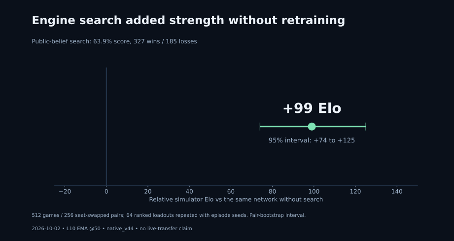

**L10 EMA @50 with vs without search, native_v44:** 512 games; +99 relative simulator Elo, reported 95% interval [+74, +125]. [Conditions, uncertainty and limitations](EVIDENCE.md).

Superhuman play is the research objective; it has not been established. Development includes AI-assisted coding and analysis. Implementation can be discussed privately with internship teams.

**[GitHub profile / contact](https://github.com/24mil)**

This is an unofficial project, not endorsed by Supercell. Gameplay belongs to Supercell; see the [Fan Content Policy](https://supercell.com/en/fan-content-policy/).
